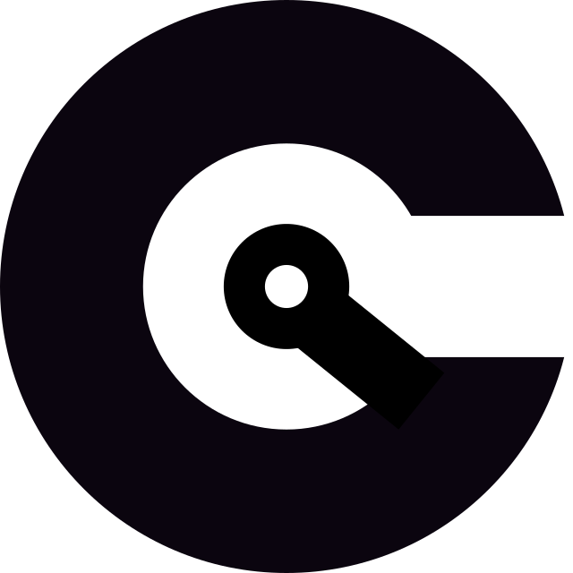

[](https://github.com/lbnl-cybersecurity/ceds-cigar/actions)
[](https://github.com/toanngosy/pycigar/blob/master/LICENSE.md)

## PyCIGAR

PyCIGAR is a computational framework for deep Reinforcement Learning and control experiments for distributed grid.

## Specifications

pyCIGAR architecture: https://docs.google.com/document/d/1W28S1yUxzKURmklZyAxK-CRtIy058kVd1wte0-lWU3g/edit 

User-facing application reqs and specs: https://docs.google.com/presentation/d/1Mhv8e4DQ3bDORWOzJXOHqVVKS0XFoja6rDCfM8H2KZw/

## Installation (Using Regular Python)

```
git clone git+ssh://USERNAME@github.com/lbnl-cybersecurity/ceds-cigar-external.git
cd ceds-cigar-external
pip3 install -r requirements.txt
python3 setup.py develop
```

## Installation (Using Anaconda of Miniconda)

```
git clone git+ssh://USERNAME@github.com/lbnl-cybersecurity/ceds-cigar-external.git
cd ceds-cigar-external
conda env create -f environment.yml
python setup_conda.py develop
```


USERNAME must be set to a github username that has access to this private repo.

You can run the install and test via the [Dockerfile](Dockerfile) if you prefer.


## Testing your installation without RLlib
------------------------

Once the above modules have been successfully installed, we can test the installation by running a few examples. Before trying to run any examples, be
sure to activate the `pycigar` conda environment by typing (if you are using conda):

    conda activate pycigar

Let’s see some action:

    python tests/sanity_test/sanity_test.py

You can run experiment without installing RLlib. This test experiment is on IEEE 34-Bus System, PV inverters are installed in 13 nodes with 20\% hack during the simulation. After the test finished, you can find a saved result plot in result/sanity_test/

*Note*: the default location for saving result is in the folder `result/`. You can change the default saving result in 
`pycigar/config.py`.


## Testing your installation with RLlib
------------------------

See (getting started with RLlib)[http://ray.readthedocs.io/en/latest/rllib.html#getting-started] for sample commands.

To run any of the RL examples, make sure to run (if you are using conda)

    conda activate pycigar

In order to test run an PyCIGAR experiment in RLlib, try the following command:

    python examples/multiagent/single_policy_head/global_single_relative_discrete_ppo.py

If it does not fail, this means that you have PyCIGAR properly configured with RLlib. By default, every 5 training iteration, we will stop, test and save result on a sample environment.  
The result will be saved in `result/cooperative_multiagent_ppo/`

To visualize the training progress:

    tensorboard --logdir=~/ray_results